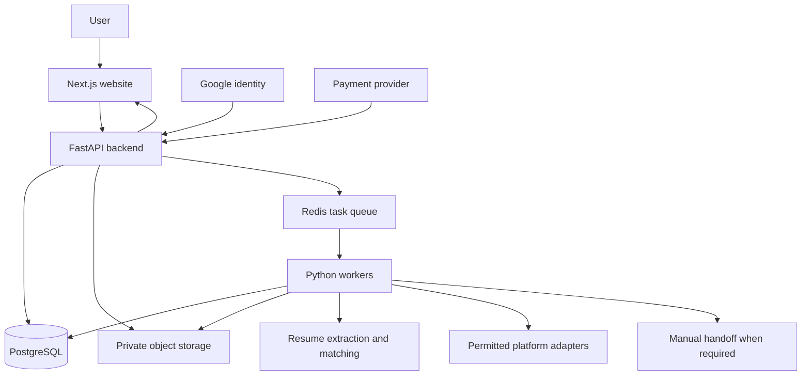

# Resume-to-application product: architecture and delivery plan

Status: original proposed architecture, based on the repository review on 2026-09-12.
An initial web MVP is now implemented. See [WEB_APP.md](WEB_APP.md) for the exact
implemented scope, architecture adjustments, verification, and deployment limits.
This document does not implement or deploy the website or change live application behavior.

## 1. Product scope and decisions

Build a website where a user signs in with Google, uploads a resume, confirms their
profile and job preferences, reviews matching jobs, and starts a controlled application run.
The dashboard explains every application, rejection, failure, and request for input.

Confirmed requirements:

- PDF and Word resume input; interpret Word as DOCX for the MVP.
- Google sign-in.
- Notice period, current compensation, expected compensation, preferred locations,
  distance from those locations, target roles, and skills.
- A minimum of three distinct matching selected skills, in addition to a matching role.
- Ten free applications, followed by a proposed INR 199 paid offering.
- Confirmed paid allowance: up to 40 confirmed job applications per day.
- Confirmed payment model: INR 199 for a one-time seven-day pass, without automatic renewal.

Proposed defaults awaiting product confirmation:

- Ten confirmed applications once per account, not every day or every new resume.
- Offer a separate company-frequency preference in addition to the confirmed
  application-based allowance.
- Paid access lasts 168 hours from activation. Define seven consecutive 24-hour
  quota windows anchored to activation, with 40 credits per window and no rollover.
  This caps paid usage at 280, avoiding an accidental eighth calendar-day allowance.
  Display the next reset in the user's timezone. If calendar-day resets are chosen
  instead, retain an explicit 280 total cap and explain partial first/last days.
- An allowance is an upper limit: do not lower matching quality to fill it.
- Automatic daily scheduling requires an explicit user choice with a stop control.
- MVP supports PDF and DOCX. Legacy DOC requires a separately sandboxed conversion
  path; do not advertise it until implemented. Password-protected files require user action.

## 2. Findings from the current implementation

`job_applications/hr_apply.py` currently mixes configuration, UI, parsing, database
access, search, browser control, question answering, application execution, and exports.

Specific findings:

1. `search_query_node` generates broad queries. The prompt favors data engineering,
   but query relevance cannot guarantee every result is a data engineering job.
2. `collect_job_cards_from_page` extracts card metadata, not a structured full job description.
3. `linkedin_job_search_node` queues results based on discovery and processing state.
   It marks Easy Apply availability from the search filter, without enforcing role,
   three-skill overlap, experience, or location requirements.
4. `easy_apply_node` opens each queued job and calls `run_easy_apply` without a
   mandatory matching decision between opening the job and filling the form.
5. Pending jobs are restored from SQLite; a full queue can skip new discovery.
   These jobs must be evaluated again against current profile/preferences.
6. Importing the module initializes an LLM, reads a fixed PDF, and eventually invokes
   the graph. Importing application code must become side-effect free.
7. A fixed local PDF is parsed through PyMuPDF. There is no implemented web upload
   or explicit DOCX parser in this entry point.
8. Candidate values, browser profile paths, and application targets are global.
   They cannot safely represent multiple customers.
9. Compensation constants contain annual rupee values despite names ending in LPA.
   Model amount, currency, period, and display units explicitly.
10. The web matcher uses each user's selected cities or states and an internal city
    catalogue; city-center distance remains approximate, not commute distance.
11. Submission confirmation exists, but some checks search the whole page.
    Confirmation must be tied to the current job and attempt before counting usage.

Moving functions into smaller files alone will not resolve these behavior problems.

## 3. Platform access is a product dependency

LinkedIn states that third-party tools that automate activity on its website are
not allowed. A browser extension or a user-local browser does not remove that restriction.
Google sign-in authenticates users to our website; it does not grant access to their
LinkedIn account or permission to submit applications there.

LinkedIn Apply Connect is an ATS integration. Do not assume it is a public API for
an applicant-side service to submit applications to arbitrary jobs.

The product therefore needs a capability-based platform adapter:

- `discover_jobs`: licensed feed, authorized integration, or user-supplied job data.
- `fetch_job_details`: only through an available permitted access route.
- `prepare_application`: produce accurate answers and a resume selection.
- `submit_application`: enabled only where the integration supports and permits it.
- `get_application_status`: authoritative confirmation where available.
- `manual_handoff`: show the job link and prepared information for the user to apply.

The existing Selenium adapter is a prototype, not a validated commercial delivery
channel. Keep it outside the public production path while access and suitability
are resolved. The MVP can still deliver resume extraction, matching, preparation,
and tracking. Manual handoff must not be labeled an automatically confirmed application.
Do not promise paid automated LinkedIn applications until a viable delivery route exists.

Sources:

- [LinkedIn automated activity policy](https://www.linkedin.com/help/linkedin/answer/a1341543)
- [LinkedIn Apply Connect overview](https://learn.microsoft.com/en-us/linkedin/talent/apply-connect/apply-connect-overview?view=li-lts-2026-03)

## 4. Matching rules: eligibility before ranking

Suggested pipeline:

```text
Discover -> Fetch full job details -> Normalize -> Evaluate hard rules
         -> Rank eligible jobs -> Show reasons -> Queue -> Revalidate -> Apply
```

The user confirms target roles and skill choices. Resume-extracted titles are suggestions;
the LLM cannot silently broaden the user's approved roles.

For the initial Data Engineer example:

```text
Allowed role: Data Engineer
Approved aliases: AWS Data Engineer, Azure Data Engineer, Senior Data Engineer
Optional adjacent roles: ETL Developer, Data Platform Engineer (user must enable)
Excluded roles: Machine Learning Engineer, Data Scientist (unless explicitly enabled)
Selected skills: PySpark, AWS, SQL, Python
Minimum distinct overlap: 3
```

Evaluate separate gates for role, skills, location/work mode, seniority/experience,
explicit required qualifications, platform capability, duplicate status, and quota.
The overall decision is ELIGIBLE, REJECTED, or NEEDS_REVIEW. Unknown role, missing job
description, ambiguous required facts, or unknown location under a strict radius
constraint must not silently pass.

| Job | Skill evidence | Result |
| --- | --- | --- |
| Data Engineer | PySpark, AWS, SQL | Eligible if other gates pass |
| Data Engineer | Python, SQL | Reject: only two selected skills |
| Machine Learning Engineer | Python, SQL, AWS, PySpark | Reject: wrong role |
| Senior Data Engineer requiring 8 years | Three selected skills; user has 3 years | Reject: required experience mismatch |
| Data Engineer without readable description | Unknown | Needs review |

Skill normalization must count unique approved concepts, not keyword occurrences:

- AWS and Amazon Web Services count once.
- Python and Python 3 count once.
- Spark does not automatically prove PySpark; SQL does not automatically prove Python.
- AWS Glue can support an AWS parent category if configured, but avoid double counting
  a child service and parent cloud as two independent matches from one mention.
- Match candidate-confirmed skills against actual job requirements with text evidence.
- Keep required and preferred skills separate. Meeting three selected skills does
  not erase an explicitly required qualification the candidate does not have.
- Treat descriptions and resumes as untrusted content; embedded instructions cannot
  modify the matching policy or cause tool calls.

Use the LLM for schema-validated extraction and evidence suggestions. Deterministic
code enforces the eligibility gates. A relevance score only ranks jobs that passed.
Store policy version, resume version, preferences version, job snapshot hash, matched
skills, evidence spans, and rejection reasons for every decision.

Revalidate restored jobs and jobs affected by changed preferences before applying.
Do not treat the number of discovered jobs as the number of eligible jobs.

## 5. User journey

1. Google sign-in; create the application's own account/session.
2. Upload PDF/DOCX; show parsing progress and readable errors.
3. Review extracted name, contact information, skills, work history, and experience.
   Users correct values before they become application facts.
4. Set target roles, required/preferred skills, minimum overlap, experience level,
   notice days, current and expected compensation, preferred cities, radius in km,
   remote/hybrid/on-site choices, relocation, work authorization, and sponsorship.
5. Preview eligible jobs with reasons: e.g. “Data Engineer; SQL, AWS, PySpark;
   within your selected area.” Show excluded-job reasons separately.
6. Choose supported platform delivery, resume version, application limit, and scope
   of authorization. Start the run; optionally enable daily runs until pass expiry.
7. Dashboard: queued, in progress, submitted, needs input, uncertain, failed, skipped.
   Allow pause, cancel, and profile edits. Cancellation stops before the next external
   action but cannot undo an already submitted application.
8. After free credits are used, show a clear paid offer and expiration/reset rules.

For distance, use geocoded coordinates and radius calculation. If only a city is
known, show approximation or ask for a better location. Do not label straight-line
distance as driving distance. Define whether remote jobs bypass geographic radius.
Unknown salary should be shown as unknown; decide whether strict salary filtering
rejects it. Do not invent screening answers, years of skill experience, or consent.

## 6. Recommended initial architecture

Use one backend codebase with clear modules and separately running worker processes.
Avoid splitting into independently maintained microservices at this stage.



| Component | Proposed choice | Purpose |
| --- | --- | --- |
| Website | Next.js, TypeScript | Sign-in, onboarding, matches, progress, billing |
| API | FastAPI, Pydantic | Authorization, validation, profiles, runs, entitlements |
| Durable records | PostgreSQL, SQLAlchemy, Alembic | Tenant data, transactions, migrations |
| Queue/workers | Celery with Redis | Long-running parsing, discovery, application tasks |
| Documents | Private S3-compatible storage | Tenant-owned resume versions and short-lived access |
| Identity | Google OpenID Connect | Verified identity and application sessions |
| Payments | Razorpay adapter, initially test mode | Checkout and verified payment events |
| Workflow | Existing LangGraph where useful | Explicit business steps and review interruptions |
| Local deployment | Docker Compose | Reproducible web/API/worker/database/queue stack |

The task queue dispatches work; LangGraph sequences business steps; PostgreSQL
owns application outcomes and financial usage. They must not maintain competing
versions of quota or application status. Use a database outbox so a committed run
cannot disappear if queue publishing fails. Workers tolerate duplicate delivery.

Keep long-running tasks outside HTTP request handlers. FastAPI's documentation
points to queue tools such as Celery for work that runs across processes/servers.
Next.js supports server and container deployment.

- [FastAPI background task guidance](https://fastapi.tiangolo.com/tutorial/background-tasks/)
- [Next.js deployment](https://nextjs.org/docs/app/getting-started/deploying)

Proposed future layout (not yet created):

```text
apps/
  web/
backend/
  app/
    api/                  # HTTP routes and authenticated dependencies
    auth/                 # Google identity and sessions
    profiles/             # User facts and preferences
    resumes/              # Uploads, parsing, extraction, versions
    matching/             # Role taxonomy, skills, policies, evidence
    applications/         # Runs, attempts, review, state transitions
    billing/              # Plans, payments, quota reservations
    integrations/         # Job sources and delivery adapters
    workflows/            # LangGraph definitions and explicit state
    workers/              # Queue entry points and scheduler
    storage/              # Database and object-store interfaces
    observability/        # Redacted events, metrics, audit records
  migrations/
  tests/
infra/                    # Containers and deployment configuration
docs/
job_applications/         # Current CLI during incremental migration
```

## 7. Data and API contracts

All tenant-owned records carry `user_id`; access checks use the verified session,
never a user ID trusted from request JSON. Database constraints and authorization
tests prevent one user accessing another user's resumes, runs, or exports.

Core records:

- `users`, `auth_identities`: provider and stable Google subject; email is an attribute.
- `profiles`, `preference_versions`: confirmed candidate facts and immutable run inputs.
- `resume_versions`: owner, private object key, hash, parser version, extracted facts.
- `jobs`, `job_snapshots`: platform identifiers and timestamped job requirements.
- `match_decisions`: owner, job snapshot, policy version, outcome, evidence and reasons.
- `application_runs`: requested scope, pinned versions, authorization, schedule, status.
- `application_attempts`: per-user job intent, execution state, timestamps, confirmation.
- `application_events`: auditable transitions; redact personal answers in ordinary logs.
- `platform_connections`: permitted account connection references, isolated per user.
- `plans`, `payments`, `entitlements`, `quota_reservations`, `usage_ledger`.
- `webhook_events`, `outbox_events`: durable event processing and deduplication.

Store money in integer minor units with currency; store annual compensation in
unambiguous units and convert only at presentation/application-field boundaries.
Use UTC timestamps and a stored timezone for display and scheduling.
Deduplicate application intent by user, platform, and platform job ID. Preserve
multiple attempts beneath that intent so retries remain inspectable.

Initial endpoints:

```text
POST /auth/google
GET  /me
POST /resumes
GET  /resumes/{id}
PUT  /profile
PUT  /preferences
POST /match-runs
GET  /match-runs/{id}/results
POST /application-runs
GET  /application-runs/{id}
POST /application-runs/{id}/pause
POST /application-runs/{id}/cancel
POST /application-attempts/{id}/answers
GET  /usage
POST /billing/checkout
POST /billing/webhook
```

Run creation returns an ID promptly; dashboard polling is sufficient initially.
Use client idempotency keys on run and checkout creation. Verify Google token
signature, issuer, audience, and expiry with supported libraries; use secure
HTTP-only application session cookies and appropriate CSRF protections.

- [Google server-side token verification](https://developers.google.com/identity/gsi/web/guides/verify-google-id-token)

## 8. Application correctness and quota

```text
DISCOVERED -> EVALUATING -> REJECTED / NEEDS_REVIEW / ELIGIBLE
ELIGIBLE -> QUEUED -> RESERVED -> PREPARING -> SUBMITTING
SUBMITTING -> CONFIRMED / UNCERTAIN / FAILED
PREPARING -> NEEDS_INPUT / CANCELLED / FAILED
```

Reserve a credit atomically before execution. Concurrent workers cannot both take
the last free credit. Confirmed submission consumes the reservation once; a definite
pre-submission failure releases it. If the worker crashes after submission, mark
the attempt uncertain and reconcile before retrying or releasing the reservation.
Do not claim exactly-once external submission when a provider offers no idempotency
or authoritative status lookup. Show uncertainty rather than double-applying.

Recheck entitlement, cancellation, matching versions, and job availability before
the submission boundary. A reservation does not extend an expired paid pass.
Apply bounded retries to transient fetch failures; do not blindly retry submit.
Use one active submission per user/platform connection initially. Worker leases
need recovery logic; a lease timeout after submission does not prove failure.

Only CONFIRMED consumes a final application credit. Viewing a job, rejecting a match,
opening a form, or making a manual handoff does not constitute confirmed submission.
If only 12 eligible jobs exist, report 12; do not submit 28 poor matches to reach 40.

Payment activation comes from verified server-side payment status, never the success
page alone. Verify webhook signatures, record provider event IDs uniquely, tolerate
duplicates and out-of-order delivery, and reconcile missing events. Handle refunds,
failed payments, pass expiry, and customer support adjustments in an auditable ledger.

- [Razorpay webhook validation and duplicate events](https://razorpay.com/docs/webhooks/validate-test/)
- [Razorpay subscription lifecycle](https://razorpay.com/docs/webhooks/subscriptions/)

## 9. Privacy, operating costs, and deployment

Resumes, salaries, answers, and platform sessions belong to the customer. Use private
storage, encryption, short-lived download URLs, least-privilege service credentials,
tenant isolation, redacted logs, configurable retention, and account/document deletion.
Validate upload types/content and size, scan uploads, constrain DOCX decompression,
and sandbox conversion/OCR. Send only necessary resume fields to model providers.
Never place resumes, `.env`, browser profiles, caches, or local customer databases
inside container images. Determine data-region and retention requirements before launch.

Measure cost per confirmed application and per active customer. At full utilization,
INR 199 / 280 is approximately INR 0.71 gross per application, before payment fees,
taxes, model calls, compute, failed attempts, storage, and support. This is a pricing
hypothesis, not evidence the service is profitable. Count discovery and failure costs too.
Cache extraction by tenant, resume hash, and extraction version; deduplicate repeated
questions within an approved profile version. Set per-run time/token/attempt budgets.

Start with a staging environment, managed PostgreSQL, private object storage, and
separate API/worker processes. Scale workers based on queue age and provider limits.
Use migrations, health checks, error monitoring, database backup/restore verification,
and separate development/test/production credentials. An initial small single-host
container deployment has a known availability limit; document it before paid launch.

Track eligibility precision, wrong-role rejection, parsing corrections, confirmed
submission rate, uncertain outcomes, queue delay, cost, support cases, and refunds.
Keep interviews/outcomes separate: an application does not promise an interview.

## 10. Step-by-step delivery with completion criteria

| Phase | Work | Complete when |
| --- | --- | --- |
| 0: Architecture and access | This specification; settle plan semantics and permitted job delivery route | Scope and platform capabilities are explicit; unsupported automation is not sold |
| 1: Matching first | Pure role/skill policy, full job snapshots, rejection reasons, revalidation of pending jobs | Wrong-role jobs fail even with four matching skills; three distinct skills required; unknown inputs do not pass |
| 2: Extract the engine | Move configuration to typed inputs; split parsing, matching, persistence, answers, adapters, graph construction; introduce explicit CLI main | Importing modules opens no UI, reads no resume, calls no model, and submits no application |
| 3: Resume/profile service | PDF/DOCX uploads, private storage, extraction, user confirmation, versioned preferences | Two users cannot read each other's files; parsing errors are actionable; edits invalidate stale matches |
| 4: Website and Google login | Authenticated onboarding, matching preview, dashboard, pause/cancel | Complete user journey works against fixture data and mock delivery |
| 5: Durable execution | Queue, outbox, state machine, leases, adapter integration, review flow | Worker restarts and duplicate messages do not double-submit; unsupported answers stop for input |
| 6: Free usage and billing | Lifetime trial, atomic quota ledger, test checkout, expiry, webhook handling | Concurrent 11th free application is blocked; duplicate payments never grant twice; seven windows cap at 280 |
| 7: Staging and pilot | Containers, CI, migrations, monitoring, backup restore, small authorized pilot | Isolation, failure recovery, matching accuracy, and unit economics meet documented launch criteria |
| 8: Paid release | Production identity/payment configuration, support/refund process, measured limits | Permitted submission route is proven and plan claims match delivered behavior |

Refactor incrementally, preserving the existing CLI until the replacement passes
behavioral tests. Do not spend the first phase rewriting all 6,000 lines. Start
with the missing matching boundary because it directly addresses wrong applications.

Phase 1 acceptance dataset must include: unrelated ML role with all selected skills;
Data Engineer with two, three, and four selected skills; duplicate synonyms; Spark
without PySpark; missing descriptions; seniority mismatch; ambiguous locations;
expired jobs; and pending jobs saved under old preferences. Test with local fixtures
before any live application submission. Establish a human-reviewed relevance set
before choosing a numerical matching-quality launch threshold.

Additional release tests: DOCX/PDF extraction failures, forged auth identity,
cross-user document access, concurrent quota reservations, timeout after submit,
duplicate/out-of-order webhooks, pass expiry during a run, cancellation, and deletion.

## 11. Immediate next implementation slice

Create a pure matching module, typed candidate/job/match models, and fixture tests.
Then add a full-description extraction boundary and invoke matching before the
application queue and again before submission, including restored jobs. Save and
display the rejection reasons. Keep this work independent of login, payment, and
browser selectors so it is directly reusable in the eventual web backend.
